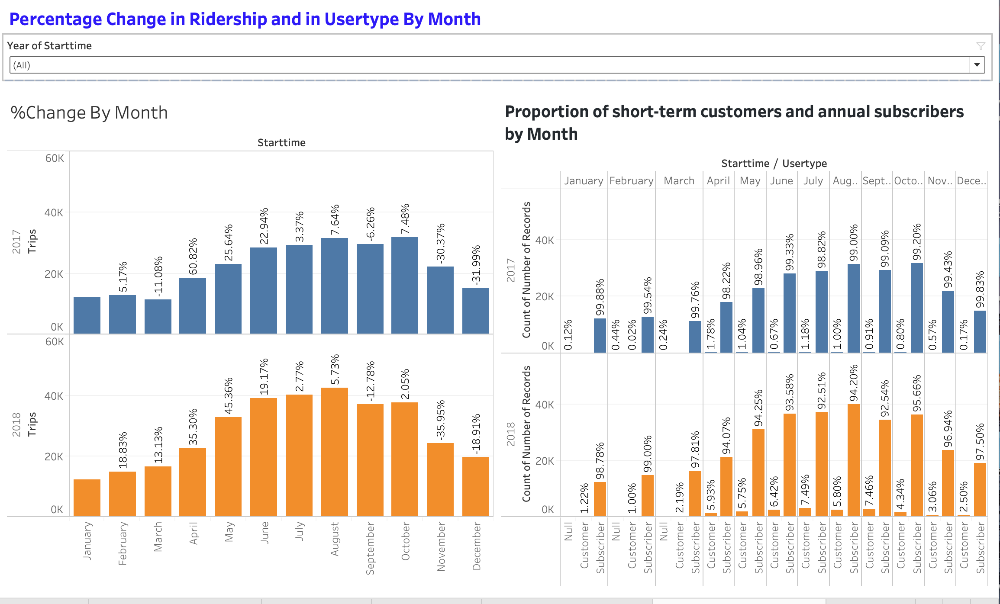
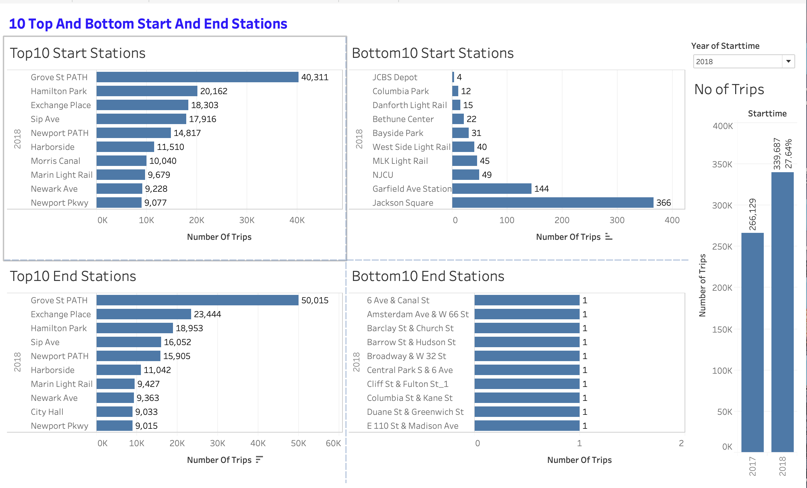
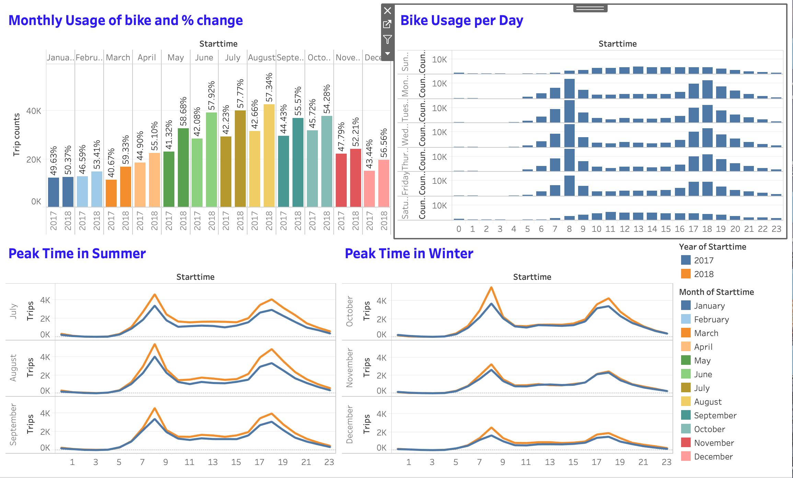
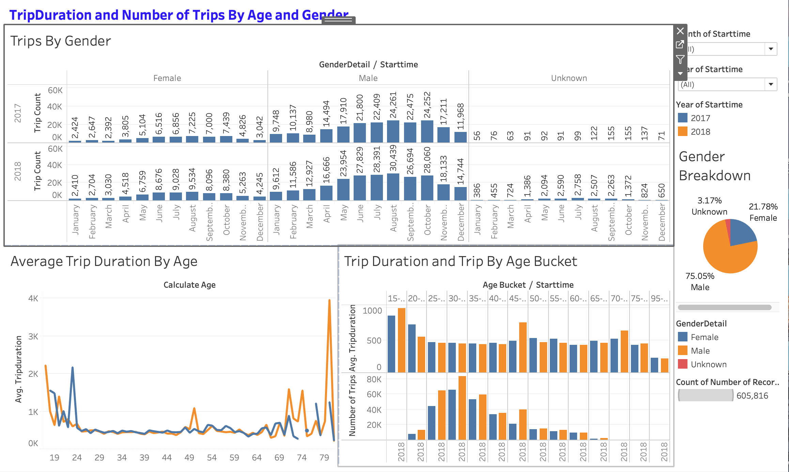
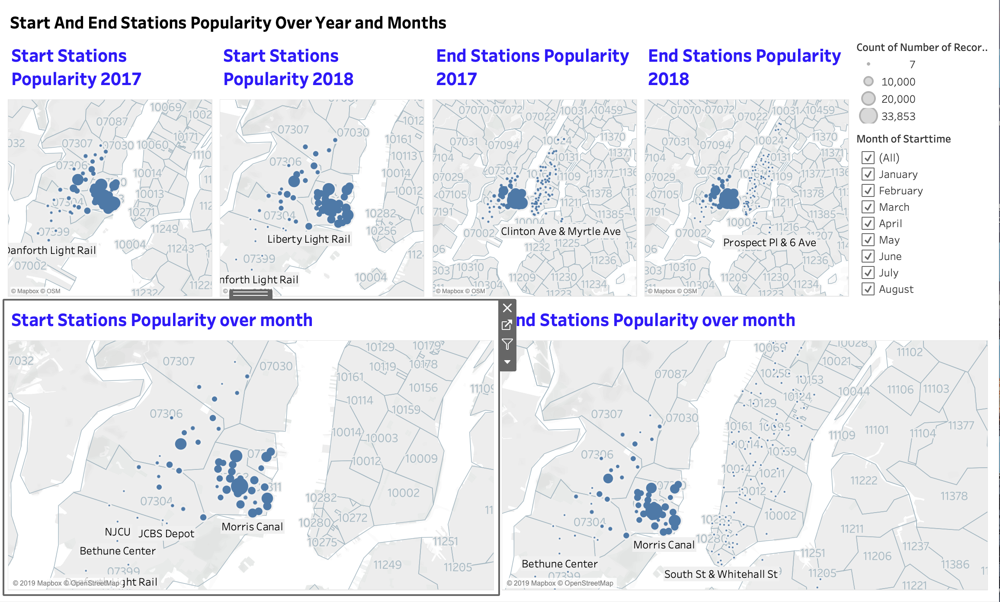

# NewYork Citi Bike Analytics

## Task
Generate reports for city officials looking to publicize and improve the city program (largest bike sharing program in the United States).

### DataSource
Since 2013, the Citi Bike Program has implemented a robust infrastructure for collecting data on the program's utilization. Through the team's efforts, each month bike data is collected, organized, and made public on the [Citi Bike Data](https://www.citibikenyc.com/system-data) webpage.

Here, Data for year 2017 and 2018 has been considered.

## Data Collecting and Cleaning
* Downloaded invidual month data, combined them into one csv file.
* 2017 and 2018 data has been considered.
* Data had column name with space. Removed unnecessary spaces in column names.
* Checked for Null values. May be user don't add usertype in hurry or some different reason. Not removing rows containg those rows as it is not affecting other analysis like total trips, most and less popular stations etc.
* Kept Data with age less than 90 years.
* Converted Birth year, starttime, stoptime column in datetime format.
* Added start and stop day of week based on datetime to see weekly effect on bike usage.
* Removed the data with trip duration greater than 3 hrs (with different start and stop days) and less than a minute. May be these bike not working and needed repair as people generally don't take bike for less than 1 minute ride. Also if duration is greater than 3hrs with different datetime means it is night time, so removing those data too. Assuming those bikes may be taken for repair or some other purpose.
* Calculated the distance in miles from start and end latitude and longitude. Removed the records with "0" distance. May be those bikes didn't get started and need repairs.

## Analysis
https://public.tableau.com/profile/bhavini5231#!/vizhome/City_Bike_Analysis_15766020308630/CityBikeAnalysis?publish=yes

* How many trips have been recorded total during the chosen period?\
2017: 266,129\
2018: 339,687

* By what percentage has total ridership grown?\
27.64% ridership growth from 2017 to 2018.

* Today, what are the top 10 stations in the city for starting a journey and ending journey?\
    Grove St Path is the most Popular in starting and ending the journey.

* Today, what are the bottom 10 stations in the city for starting a journey and ending journey? \

Based on below graph and can be seen in Tableau dashboard that for both the years 2017-2018, stations popularity not changing much. Based on that, we can say that those stations will remain same.

* How has the proportion of short-term customers and annual subscribers changed?\
Subscribers are higher in number than customers (short term).\
Total riders increase during summer month, but it is interesting to see that rate of customers also increases during that time. May be due to summer, travelers used the bikes for short distances.

* What are the peak hours in which bikes are used during summer months?
* What are the peak hours in which bikes are used during winter months?\
During Summer and Winter, Bike usage is mostly between 7-9am and 6-8pm during weekdays. It is understood that mainly students and working people uses bike more due to the bike usage in constant time period.\
While during weekends, Bike usage increases after 9am and starts to decrease after 7pm.

* What is the gender breakdown of active participants (Male v. Female)?\
 Male riders are higher than female riders. Also there are data which doesn’t contain any gender info. People don’t want to tell or may be in hurry.\
* How effective has gender outreach been in increasing female ridership over the timespan?\
Female and male riders increases over the time. Male Riders are majority.
* How does the average trip duration change by age?
Riders of age between 15-20 and 45-50 years are more compared to other age.

### Analysis By Map

https://public.tableau.com/profile/bhavini5231#!/vizhome/Station_popularity/StationsPopularity?publish=yes

* A static map that plots all bike stations with a visual indication of the most popular locations to start and end a journey with zip code data overlaid on top.

* A dynamic map that shows how each station's popularity changes over time (by month and year). Again, with zip code data overlaid on the map.\

By looking at maps, it seems either this limited dataset doesn’t contain Manhattan data or in Manhattan area these are very few use of ending stations. There is no starting station over that area.

